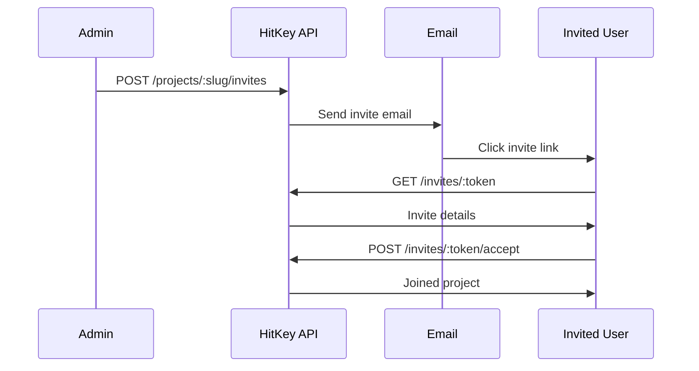

# Invites Endpoints

Invite endpoints handle project invitations. Some are public (viewing an invite), others require authentication (accepting).

## View Invite

Get information about an invite by its token. This is a public endpoint — no authentication required.

```
GET /invites/:token
```

**Response `200`:**

```json
{
  "id": "invite-uuid",
  "email": "user@example.com",
  "role": "member",
  "project": {
    "name": "My App",
    "slug": "my-app"
  },
  "invitedBy": {
    "displayName": "Project Owner"
  },
  "expiresAt": "2024-01-15T00:00:00.000Z",
  "is_expired": false
}
```

**Errors:**

| Status | Description |
|--------|-------------|
| 404 | Invite not found or expired |

---

## Accept Invite

Accept a project invitation. The authenticated user joins the project with the role specified in the invite.

```
POST /invites/:token/accept
```

**Authentication:** Required

**Response `200`:**

```json
{
  "project_slug": "my-app",
  "redirect_url": "https://myapp.com/welcome"
}
```

**Errors:**

| Status | Code | Description |
|--------|------|-------------|
| 400 | `INVITE_EXPIRED` | Invite has expired |
| 400 | `EMAIL_MISMATCH` | Invite sent to a different email |
| 400 | `ALREADY_MEMBER` | Already a member of this project |
| 404 | `INVITE_NOT_FOUND` | Invite not found |

::: info Email matching
If the invite was sent to a specific email, the accepting user must have that email verified in their HitKey account.
:::

---

## Invite Flow



## Register with Invite

New users can register directly through an invite link:

```
POST /auth/register/with-invite
```

**Request Body:**

```json
{
  "invite_token": "INVITE_TOKEN",
  "email": "user@example.com",
  "password": "secure_password"
}
```

**Response `200`:**

```json
{
  "token": "hitkey_...",
  "refresh_token": "a1b2c3d4e5f6...",
  "expires_in": 3600,
  "user": {
    "id": "uuid",
    "email": "user@example.com",
    "displayName": "User"
  },
  "project_slug": "my-app",
  "redirect_url": "https://myapp.com/welcome"
}
```

This creates an account and accepts the invite in one step, bypassing the normal 3-step registration flow.
