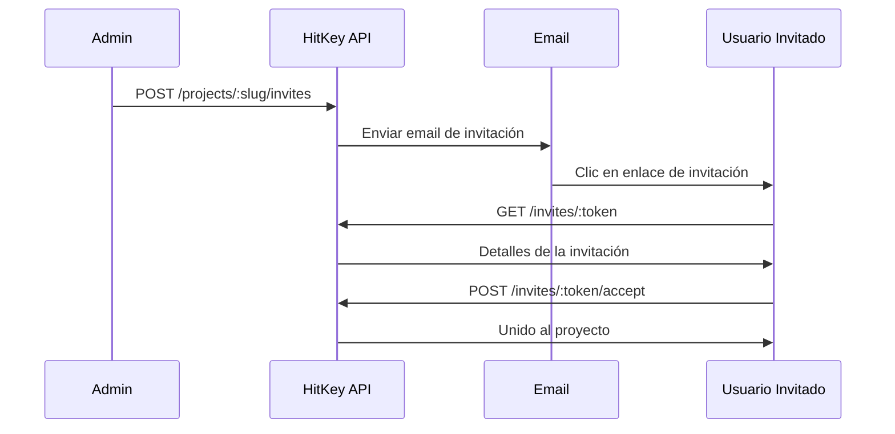

# Endpoints de Invitaciones

Los endpoints de invitaciones gestionan las invitaciones a proyectos. Algunos son públicos (ver una invitación), otros requieren autenticación (aceptar).

## Ver Invitación

Obtiene información sobre una invitación por su token. Este es un endpoint público — no requiere autenticación.

```
GET /invites/:token
```

**Respuesta `200`:**

```json
{
  "id": "invite-uuid",
  "email": "user@example.com",
  "role": "member",
  "project": {
    "name": "My App",
    "slug": "my-app"
  },
  "invitedBy": {
    "displayName": "Project Owner"
  },
  "expiresAt": "2024-01-15T00:00:00.000Z",
  "is_expired": false
}
```

**Errores:**

| Estado | Descripción |
|--------|-------------|
| 404 | Invitación no encontrada o expirada |

---

## Aceptar Invitación

Acepta una invitación a un proyecto. El usuario autenticado se une al proyecto con el rol especificado en la invitación.

```
POST /invites/:token/accept
```

**Autenticación:** Requerida

**Respuesta `200`:**

```json
{
  "project_slug": "my-app",
  "redirect_url": "https://myapp.com/welcome"
}
```

**Errores:**

| Estado | Código | Descripción |
|--------|--------|-------------|
| 400 | `INVITE_EXPIRED` | La invitación ha expirado |
| 400 | `EMAIL_MISMATCH` | La invitación fue enviada a otro email |
| 400 | `ALREADY_MEMBER` | Ya es miembro de este proyecto |
| 404 | `INVITE_NOT_FOUND` | Invitación no encontrada |

::: info Coincidencia de email
Si la invitación fue enviada a un email específico, el usuario que la acepta debe tener ese email verificado en su cuenta de HitKey.
:::

---

## Flujo de Invitación



## Registrarse con Invitación

Los nuevos usuarios pueden registrarse directamente a través de un enlace de invitación:

```
POST /auth/register/with-invite
```

**Cuerpo de la solicitud:**

```json
{
  "invite_token": "INVITE_TOKEN",
  "email": "user@example.com",
  "password": "secure_password"
}
```

**Respuesta `200`:**

```json
{
  "token": "hitkey_...",
  "refresh_token": "a1b2c3d4e5f6...",
  "expires_in": 3600,
  "user": {
    "id": "uuid",
    "email": "user@example.com",
    "displayName": "User"
  },
  "project_slug": "my-app",
  "redirect_url": "https://myapp.com/welcome"
}
```

Esto crea una cuenta y acepta la invitación en un solo paso, omitiendo el flujo normal de registro en 3 pasos.
