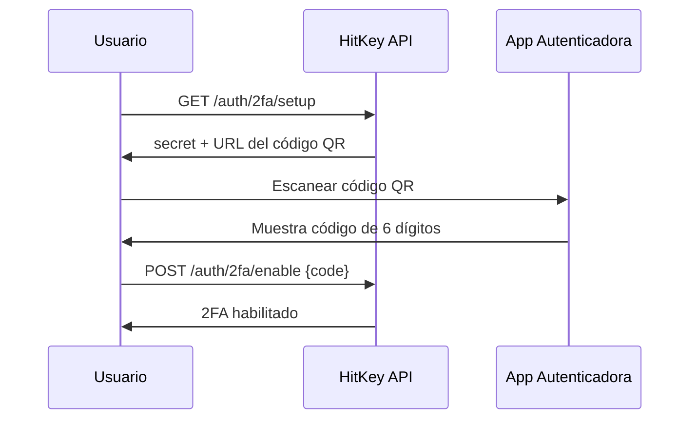

# Autenticación de Dos Factores

HitKey soporta autenticación de dos factores (2FA) basada en TOTP utilizando aplicaciones autenticadoras estándar (Google Authenticator, Authy, 1Password, etc.).

## Cómo Funciona

Cuando 2FA está habilitado, el inicio de sesión requiere dos pasos:
1. **Contraseña** — autenticación normal con email + contraseña
2. **Código TOTP** — código de 6 dígitos de la aplicación autenticadora

## Flujo de Configuración



### 1. Obtener Información de Configuración

```bash
curl https://api.hitkey.io/auth/2fa/setup \
  -H "Authorization: Bearer $TOKEN"
```

Respuesta:

```json
{
  "secret": "JBSWY3DPEHPK3PXP",
  "qrCodeUrl": "otpauth://totp/HitKey:user@example.com?secret=JBSWY3DPEHPK3PXP&issuer=HitKey"
}
```

Muestra la `qrCodeUrl` como un código QR para que el usuario lo escanee.

### 2. Habilitar 2FA

Después de que el usuario escanee el código QR y obtenga su primer código TOTP:

```bash
curl -X POST https://api.hitkey.io/auth/2fa/enable \
  -H "Authorization: Bearer $TOKEN" \
  -H "Content-Type: application/json" \
  -d '{"code": "123456"}'
```

## Iniciar Sesión con 2FA

Cuando 2FA está habilitado, `POST /auth/login` devuelve un `202` con un desafío en lugar de un token:

```json
{
  "totp_required": true,
  "challenge_token": "a1b2c3d4e5f6..."
}
```

Completa el inicio de sesión verificando el código TOTP:

```bash
curl -X POST https://api.hitkey.io/auth/2fa/verify \
  -H "Content-Type: application/json" \
  -d '{
    "challenge_token": "a1b2c3d4e5f6...",
    "code": "654321"
  }'
```

Al completarse con éxito, devuelve la respuesta normal de inicio de sesión con un Bearer token.

## Deshabilitar 2FA

```bash
curl -X POST https://api.hitkey.io/auth/2fa/disable \
  -H "Authorization: Bearer $TOKEN" \
  -H "Content-Type: application/json" \
  -d '{"code": "123456"}'
```

Requiere un código TOTP válido para confirmar la acción.

## Impacto en el Flujo OAuth

2FA es **transparente** para las aplicaciones asociadas. Cuando un usuario con 2FA habilitado pasa por el flujo de autorización OAuth:

1. El frontend de HitKey gestiona el desafío TOTP
2. El código de autorización solo se emite después de un 2FA exitoso
3. Tu aplicación no necesita ningún cambio

El paso de 2FA ocurre completamente dentro de la UI de inicio de sesión de HitKey — tu redirección OAuth simplemente espera a que el usuario complete ambos pasos de autenticación.

## Detalles de Implementación TOTP

- **Algoritmo:** HMAC-SHA1 (RFC 6238)
- **Dígitos:** 6
- **Período:** 30 segundos
- **Aplicaciones compatibles:** Google Authenticator, Authy, 1Password, Bitwarden, etc.
