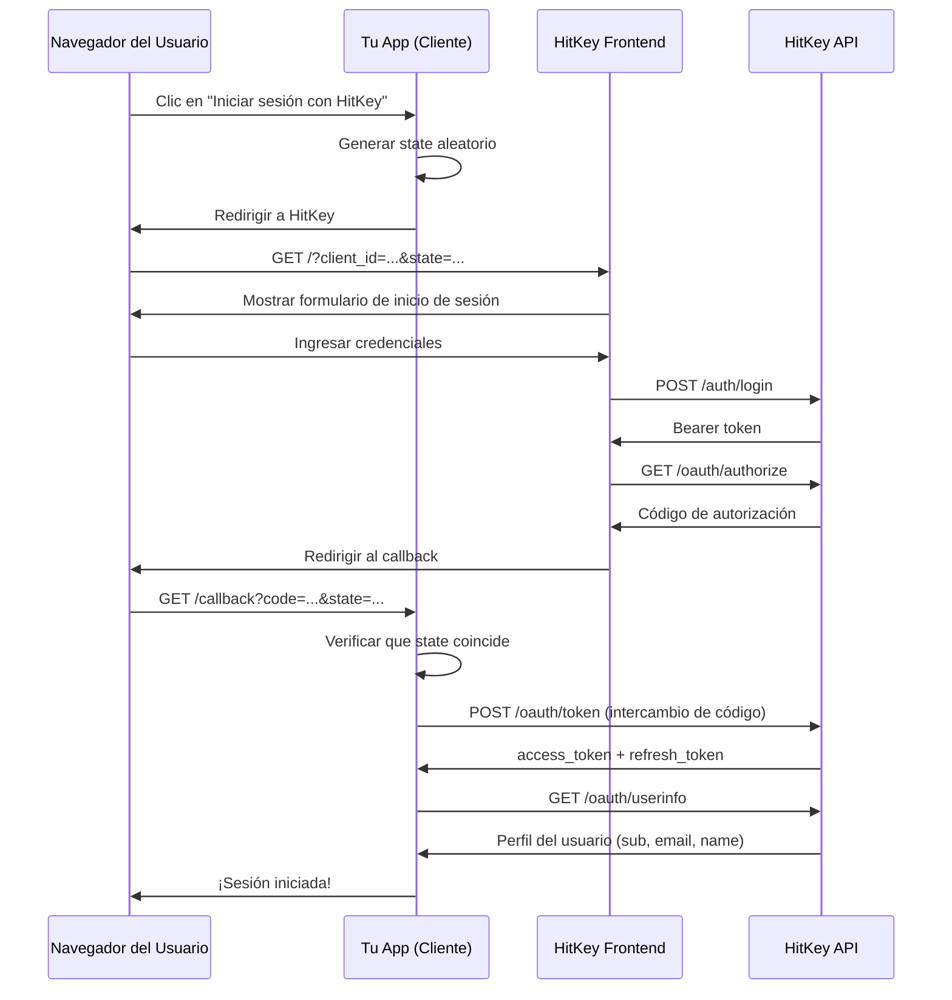

# Flujo de Código de Autorización OAuth2

HitKey implementa el flujo de Código de Autorización OAuth2 — el estándar más seguro para aplicaciones del lado del servidor.

## Visión General



## Paso a Paso

### 1. Iniciar la Autorización

Tu aplicación redirige al usuario a HitKey con estos parámetros:

```
https://hitkey.io/?client_id=CLIENT_ID&redirect_uri=REDIRECT_URI&response_type=code&state=STATE&scope=openid+profile+email
```

**Parámetros:**

| Parámetro | Obligatorio | Descripción |
|-----------|-------------|-------------|
| `client_id` | Sí | Tu ID de cliente OAuth |
| `redirect_uri` | Sí | URL de callback registrada |
| `response_type` | Sí | Debe ser `code` |
| `state` | Sí | Cadena aleatoria para protección CSRF |
| `scope` | No | Scopes separados por espacio (por defecto: `openid`) |

::: info Parámetro state
Genera siempre un valor `state` criptográficamente aleatorio, almacénalo en la sesión del usuario y verifícalo cuando llegue el callback. Esto previene ataques CSRF.
:::

### 2. Autenticación del Usuario

El frontend de HitKey gestiona la UI de inicio de sesión. El usuario puede:
- **Iniciar sesión** con credenciales existentes
- **Registrarse** con una cuenta nueva (verificación de email en 3 pasos)
- **Completar 2FA** si está habilitado

Tu aplicación no gestiona nada de esto — HitKey maneja toda la experiencia de autenticación.

### 3. Código de Autorización

Tras una autenticación exitosa, la API de HitKey devuelve una respuesta JSON al frontend:

```json
{
  "redirect_url": "https://myapp.com/callback?code=AUTH_CODE&state=STATE"
}
```

El frontend entonces redirige al usuario a tu `redirect_uri` con:
- `code` — código de autorización de un solo uso (válido por 10 minutos)
- `state` — el mismo state que enviaste en el paso 1

::: warning
El código de autorización es de un solo uso. Una vez intercambiado por tokens, no puede reutilizarse.
:::

### 4. Intercambio de Tokens

Tu **backend** intercambia el código de autorización por tokens:

```bash
POST https://api.hitkey.io/oauth/token
Content-Type: application/json

{
  "grant_type": "authorization_code",
  "code": "AUTH_CODE",
  "client_id": "YOUR_CLIENT_ID",
  "client_secret": "YOUR_CLIENT_SECRET",
  "redirect_uri": "https://myapp.com/callback"
}
```

Respuesta:

```json
{
  "access_token": "eyJhbGciOi...",
  "refresh_token": "dGhpcyBpcyBh...",
  "token_type": "Bearer",
  "expires_in": 3600,
  "scope": "openid profile email"
}
```

::: danger
Nunca expongas el `client_secret` en código del frontend. El intercambio de tokens debe realizarse en tu backend.
:::

### 5. Obtener Información del Usuario

Usa el access token para recuperar el perfil del usuario:

```bash
GET https://api.hitkey.io/oauth/userinfo
Authorization: Bearer ACCESS_TOKEN
```

Respuesta (depende de los scopes concedidos):

```json
{
  "sub": "550e8400-e29b-41d4-a716-446655440000",
  "id": "550e8400-e29b-41d4-a716-446655440000",
  "email": "user@example.com",
  "name": "John Doe",
  "given_name": "John",
  "family_name": "Doe",
  "display_name": "John Doe",
  "preferred_username": "johndoe"
}
```

### 6. Actualización de Token

Los tokens de acceso expiran después de **1 hora**. Usa el refresh token para obtener un nuevo access token:

```bash
POST https://api.hitkey.io/oauth/token
Content-Type: application/json

{
  "grant_type": "refresh_token",
  "refresh_token": "REFRESH_TOKEN",
  "client_id": "YOUR_CLIENT_ID",
  "client_secret": "YOUR_CLIENT_SECRET"
}
```

::: info Sin rotación de tokens
El refresh de OAuth **no** rota el refresh token — el mismo refresh token sigue siendo válido. Solo se emite un nuevo access token. Los refresh tokens tienen una ventana deslizante de 30 días y un límite absoluto de 90 días.
:::

## Consideraciones de Seguridad

| Preocupación | Mitigación |
|--------------|------------|
| CSRF | Parámetro `state` — generar, almacenar en sesión, verificar en el callback |
| Interceptación de código | Los códigos de autorización son de un solo uso y expiran en 10 minutos |
| Filtración de tokens | El `client_secret` nunca sale de tu backend |
| Robo de tokens | Tokens de acceso de corta duración (1h) |
| Ataques de repetición | Los códigos de autorización usados se invalidan |

## Coincidencia de Redirect URI

HitKey normaliza las redirect URIs antes de compararlas:
- La codificación URL se decodifica automáticamente
- Las barras finales se gestionan

Sin embargo, el **dominio, puerto y ruta** deben coincidir exactamente. Registra tu URI de producción al crear el cliente OAuth.

## ¿Qué Pasa con 2FA?

Si el usuario tiene 2FA habilitado, HitKey lo gestiona de forma transparente durante el paso 2. Tu aplicación no necesita ningún cambio — el flujo de inicio de sesión simplemente incluye un paso adicional de verificación TOTP en el lado de HitKey.
