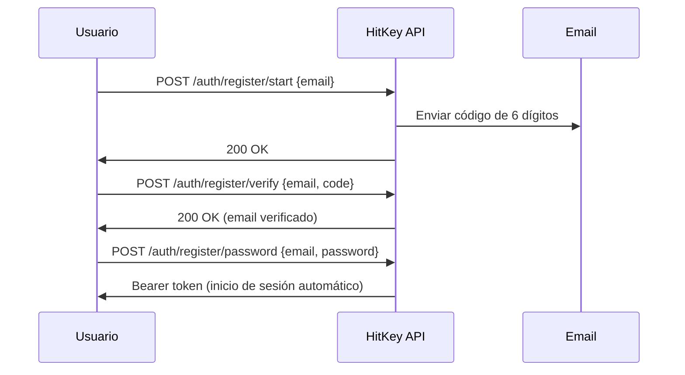

# Registro

HitKey utiliza un flujo de registro en 3 pasos con verificación de email.

## Visión General del Flujo



## Paso 1: Iniciar Registro

```bash
curl -X POST https://api.hitkey.io/auth/register/start \
  -H "Content-Type: application/json" \
  -d '{"email": "user@example.com"}'
```

Se envía un código de verificación de 6 dígitos a la dirección de email.

**Propiedades del código:**
- Válido por **10 minutos**
- Máximo **3 intentos de verificación**
- Se puede reenviar después de **60 segundos** de espera

## Paso 2: Verificar Email

```bash
curl -X POST https://api.hitkey.io/auth/register/verify \
  -H "Content-Type: application/json" \
  -d '{"email": "user@example.com", "code": "123456"}'
```

**Errores:**

| Código | Descripción |
|--------|-------------|
| `INVALID_CODE` | Código de verificación incorrecto |
| `CODE_EXPIRED` | El código ha expirado (10 min) |
| `TOO_MANY_ATTEMPTS` | 3 intentos fallidos — solicita un nuevo código |
| `NO_CODE` | No hay verificación pendiente para este email |
| `EMAIL_ALREADY_VERIFIED` | El email ya está verificado |

## Paso 3: Establecer Contraseña

```bash
curl -X POST https://api.hitkey.io/auth/register/password \
  -H "Content-Type: application/json" \
  -d '{
    "email": "user@example.com",
    "password": "secure_password"
  }'
```

Al completarse con éxito, el usuario inicia sesión automáticamente y recibe un Bearer token:

**Respuesta `200`:**

```json
{
  "message": "Registration completed",
  "type": "bearer",
  "token": "hitkey_...",
  "refresh_token": "a1b2c3d4e5f6...",
  "expires_in": 3600,
  "user": {
    "id": "uuid",
    "email": "user@example.com",
    "displayName": "user"
  }
}
```

## Reenviar Código

```bash
curl -X POST https://api.hitkey.io/auth/register/resend \
  -H "Content-Type: application/json" \
  -d '{"email": "user@example.com"}'
```

::: info Tiempo de espera
El endpoint de reenvío tiene un tiempo de espera de 60 segundos para prevenir abusos. El frontend debe mostrar un temporizador de cuenta regresiva.
:::

## Registrarse con Invitación

Los usuarios invitados a un proyecto pueden registrarse en un solo paso:

```bash
curl -X POST https://api.hitkey.io/auth/register/with-invite \
  -H "Content-Type: application/json" \
  -d '{
    "invite_token": "INVITE_TOKEN",
    "email": "user@example.com",
    "password": "secure_password"
  }'
```

Esto omite la verificación de email (la invitación sirve como prueba) y añade automáticamente al usuario al proyecto.

**Respuesta `200`:**

```json
{
  "token": "hitkey_...",
  "refresh_token": "a1b2c3d4e5f6...",
  "expires_in": 3600,
  "user": {
    "id": "uuid",
    "email": "user@example.com",
    "displayName": "user"
  },
  "project_slug": "my-app",
  "redirect_url": "https://myapp.com/welcome"
}
```
