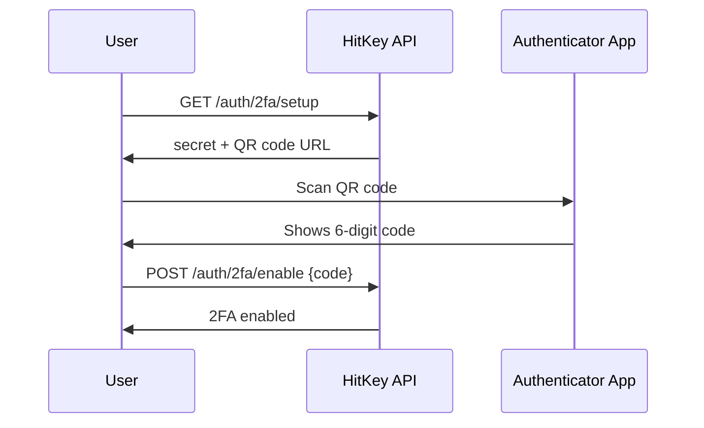

# Two-Factor Authentication

HitKey supports TOTP-based two-factor authentication (2FA) using standard authenticator apps (Google Authenticator, Authy, 1Password, etc.).

## How It Works

When 2FA is enabled, login requires two steps:
1. **Password** — normal email + password authentication
2. **TOTP code** — 6-digit code from the authenticator app

## Setup Flow



### 1. Get Setup Info

```bash
curl https://api.hitkey.io/auth/2fa/setup \
  -H "Authorization: Bearer $TOKEN"
```

Response:

```json
{
  "secret": "JBSWY3DPEHPK3PXP",
  "qrCodeUrl": "otpauth://totp/HitKey:user@example.com?secret=JBSWY3DPEHPK3PXP&issuer=HitKey"
}
```

Display the `qrCodeUrl` as a QR code for the user to scan.

### 2. Enable 2FA

After the user scans the QR code and gets their first TOTP code:

```bash
curl -X POST https://api.hitkey.io/auth/2fa/enable \
  -H "Authorization: Bearer $TOKEN" \
  -H "Content-Type: application/json" \
  -d '{"code": "123456"}'
```

## Login with 2FA

When 2FA is enabled, `POST /auth/login` returns a `202` challenge instead of a token:

```json
{
  "totp_required": true,
  "challenge_token": "a1b2c3d4e5f6..."
}
```

Complete the login by verifying the TOTP code:

```bash
curl -X POST https://api.hitkey.io/auth/2fa/verify \
  -H "Content-Type: application/json" \
  -d '{
    "challenge_token": "a1b2c3d4e5f6...",
    "code": "654321"
  }'
```

On success, returns the normal login response with a Bearer token.

## Disable 2FA

```bash
curl -X POST https://api.hitkey.io/auth/2fa/disable \
  -H "Authorization: Bearer $TOKEN" \
  -H "Content-Type: application/json" \
  -d '{"code": "123456"}'
```

Requires a valid TOTP code to confirm the action.

## Impact on OAuth Flow

2FA is **transparent** to partner applications. When a user with 2FA enabled goes through the OAuth authorization flow:

1. HitKey's frontend handles the TOTP challenge
2. The authorization code is issued only after successful 2FA
3. Your application doesn't need any changes

The 2FA step happens entirely within HitKey's login UI — your OAuth redirect simply waits for the user to complete both authentication steps.

## TOTP Implementation Details

- **Algorithm:** HMAC-SHA1 (RFC 6238)
- **Digits:** 6
- **Period:** 30 seconds
- **Compatible apps:** Google Authenticator, Authy, 1Password, Bitwarden, etc.
