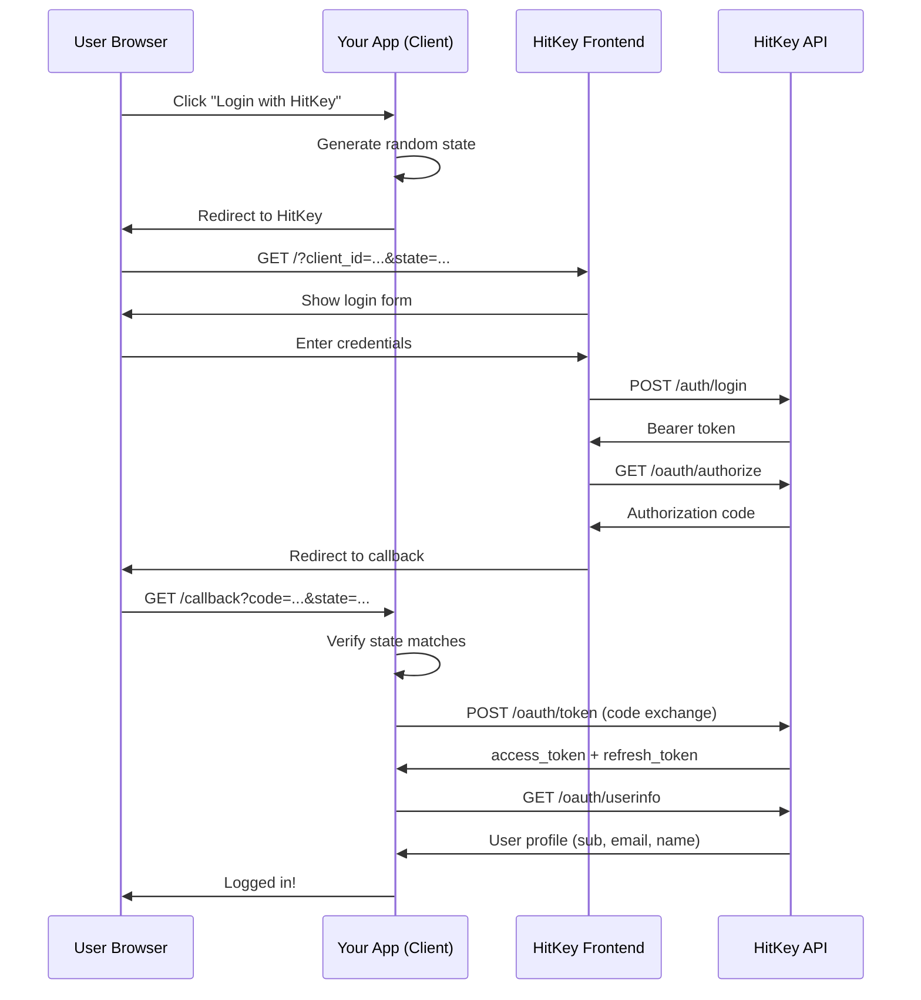

# OAuth2 Authorization Code Flow

HitKey implements the OAuth2 Authorization Code flow — the most secure standard for server-side applications.

## Overview



## Step by Step

### 1. Initiate Authorization

Your application redirects the user to HitKey with these parameters:

```
https://hitkey.io/?client_id=CLIENT_ID&redirect_uri=REDIRECT_URI&response_type=code&state=STATE&scope=openid+profile+email
```

**Parameters:**

| Parameter | Required | Description |
|-----------|----------|-------------|
| `client_id` | Yes | Your OAuth client ID |
| `redirect_uri` | Yes | Registered callback URL |
| `response_type` | Yes | Must be `code` |
| `state` | Yes | Random string for CSRF protection |
| `scope` | No | Space-separated scopes (default: `openid`) |

::: info State parameter
Always generate a cryptographically random `state` value, store it in the user's session, and verify it when the callback arrives. This prevents CSRF attacks.
:::

### 2. User Authentication

HitKey's frontend handles the login UI. The user either:
- **Logs in** with existing credentials
- **Registers** a new account (3-step email verification)
- **Completes 2FA** if enabled

Your application doesn't handle any of this — HitKey manages the entire authentication UX.

### 3. Authorization Code

After successful authentication, HitKey's API returns a JSON response to the frontend:

```json
{
  "redirect_url": "https://myapp.com/callback?code=AUTH_CODE&state=STATE"
}
```

The frontend then redirects the user to your `redirect_uri` with:
- `code` — one-time authorization code (valid for 10 minutes)
- `state` — the same state you sent in step 1

::: warning
The authorization code is single-use. Once exchanged for tokens, it cannot be reused.
:::

### 4. Token Exchange

Your **backend** exchanges the authorization code for tokens:

```bash
POST https://api.hitkey.io/oauth/token
Content-Type: application/json

{
  "grant_type": "authorization_code",
  "code": "AUTH_CODE",
  "client_id": "YOUR_CLIENT_ID",
  "client_secret": "YOUR_CLIENT_SECRET",
  "redirect_uri": "https://myapp.com/callback"
}
```

Response:

```json
{
  "access_token": "eyJhbGciOi...",
  "refresh_token": "dGhpcyBpcyBh...",
  "token_type": "Bearer",
  "expires_in": 3600,
  "scope": "openid profile email"
}
```

::: danger
Never expose `client_secret` in frontend code. Token exchange must happen on your backend.
:::

### 5. Get User Info

Use the access token to retrieve the user's profile:

```bash
GET https://api.hitkey.io/oauth/userinfo
Authorization: Bearer ACCESS_TOKEN
```

Response (depends on granted scopes):

```json
{
  "sub": "550e8400-e29b-41d4-a716-446655440000",
  "id": "550e8400-e29b-41d4-a716-446655440000",
  "email": "user@example.com",
  "name": "John Doe",
  "given_name": "John",
  "family_name": "Doe",
  "display_name": "John Doe",
  "preferred_username": "johndoe"
}
```

### 6. Token Refresh

Access tokens expire after **1 hour**. Use the refresh token to get a new access token:

```bash
POST https://api.hitkey.io/oauth/token
Content-Type: application/json

{
  "grant_type": "refresh_token",
  "refresh_token": "REFRESH_TOKEN",
  "client_id": "YOUR_CLIENT_ID",
  "client_secret": "YOUR_CLIENT_SECRET"
}
```

::: info No token rotation
OAuth refresh does **not** rotate the refresh token — the same refresh token remains valid. Only a new access token is issued. Refresh tokens have a 30-day sliding window and a 90-day absolute cap.
:::

## Security Considerations

| Concern | Mitigation |
|---------|------------|
| CSRF | `state` parameter — generate, store in session, verify on callback |
| Code interception | Authorization codes are single-use and expire in 10 minutes |
| Token leakage | `client_secret` never leaves your backend |
| Token theft | Short-lived access tokens (1h) |
| Replay attacks | Used authorization codes are invalidated |

## Redirect URI Matching

HitKey normalizes redirect URIs before comparison:
- URL-encoding is auto-decoded
- Trailing slashes are handled

However, the **domain, port, and path** must match exactly. Register your production URI when creating the OAuth client.

## What About 2FA?

If the user has 2FA enabled, HitKey handles it transparently during step 2. Your application doesn't need any changes — the login flow simply includes an additional TOTP verification step on HitKey's side.
