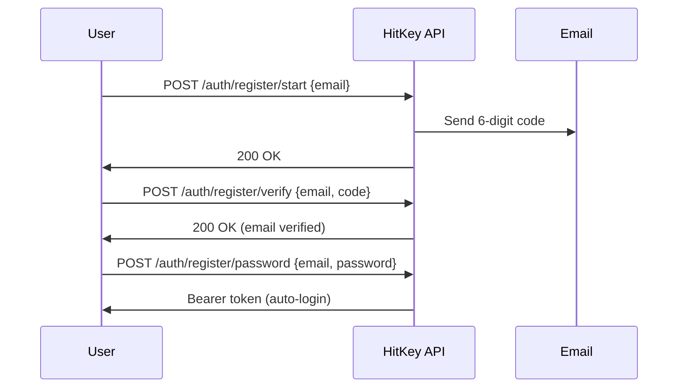

# Registration

HitKey uses a 3-step registration flow with email verification.

## Flow Overview



## Step 1: Start Registration

```bash
curl -X POST https://api.hitkey.io/auth/register/start \
  -H "Content-Type: application/json" \
  -d '{"email": "user@example.com"}'
```

A 6-digit verification code is sent to the email address.

**Code properties:**
- Valid for **10 minutes**
- Maximum **3 verification attempts**
- Can be resent after **60 seconds** cooldown

## Step 2: Verify Email

```bash
curl -X POST https://api.hitkey.io/auth/register/verify \
  -H "Content-Type: application/json" \
  -d '{"email": "user@example.com", "code": "123456"}'
```

**Errors:**

| Code | Description |
|------|-------------|
| `INVALID_CODE` | Wrong verification code |
| `CODE_EXPIRED` | Code has expired (10 min) |
| `TOO_MANY_ATTEMPTS` | 3 failed attempts — request a new code |
| `NO_CODE` | No pending verification for this email |
| `EMAIL_ALREADY_VERIFIED` | Email already verified |

## Step 3: Set Password

```bash
curl -X POST https://api.hitkey.io/auth/register/password \
  -H "Content-Type: application/json" \
  -d '{
    "email": "user@example.com",
    "password": "secure_password"
  }'
```

On success, the user is automatically logged in and receives a Bearer token:

**Response `200`:**

```json
{
  "message": "Registration completed",
  "type": "bearer",
  "token": "hitkey_...",
  "refresh_token": "a1b2c3d4e5f6...",
  "expires_in": 3600,
  "user": {
    "id": "uuid",
    "email": "user@example.com",
    "displayName": "user"
  }
}
```

## Resend Code

```bash
curl -X POST https://api.hitkey.io/auth/register/resend \
  -H "Content-Type: application/json" \
  -d '{"email": "user@example.com"}'
```

::: info Cooldown
The resend endpoint has a 60-second cooldown to prevent abuse. The frontend should show a countdown timer.
:::

## Register with Invite

Users invited to a project can register in a single step:

```bash
curl -X POST https://api.hitkey.io/auth/register/with-invite \
  -H "Content-Type: application/json" \
  -d '{
    "invite_token": "INVITE_TOKEN",
    "email": "user@example.com",
    "password": "secure_password"
  }'
```

This skips email verification (the invite serves as proof) and automatically adds the user to the project.

**Response `200`:**

```json
{
  "token": "hitkey_...",
  "refresh_token": "a1b2c3d4e5f6...",
  "expires_in": 3600,
  "user": {
    "id": "uuid",
    "email": "user@example.com",
    "displayName": "user"
  },
  "project_slug": "my-app",
  "redirect_url": "https://myapp.com/welcome"
}
```
