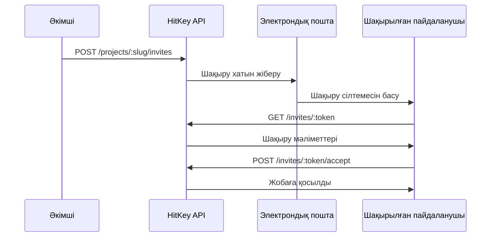

# Шақырулар эндпоинттері

Шақыру эндпоинттері жоба шақыруларын өңдейді. Кейбіреулері ашық (шақыруды қарау), басқалары аутентификацияны талап етеді (қабылдау).

## Шақыруды қарау

Шақыру туралы ақпаратты оның токені арқылы алу. Бұл ашық эндпоинт — аутентификация қажет емес.

```
GET /invites/:token
```

**Жауап `200`:**

```json
{
  "id": "invite-uuid",
  "email": "user@example.com",
  "role": "member",
  "project": {
    "name": "My App",
    "slug": "my-app"
  },
  "invitedBy": {
    "displayName": "Project Owner"
  },
  "expiresAt": "2024-01-15T00:00:00.000Z",
  "is_expired": false
}
```

**Қателер:**

| Статус | Сипаттама |
|--------|-----------|
| 404 | Шақыру табылмады немесе мерзімі аяқталған |

---

## Шақыруды қабылдау

Жоба шақыруын қабылдау. Аутентификацияланған пайдаланушы шақыруда көрсетілген рөлмен жобаға қосылады.

```
POST /invites/:token/accept
```

**Аутентификация:** Қажет

**Жауап `200`:**

```json
{
  "project_slug": "my-app",
  "redirect_url": "https://myapp.com/welcome"
}
```

**Қателер:**

| Статус | Код | Сипаттама |
|--------|-----|-----------|
| 400 | `INVITE_EXPIRED` | Шақыру мерзімі аяқталған |
| 400 | `EMAIL_MISMATCH` | Шақыру басқа email-ге жіберілген |
| 400 | `ALREADY_MEMBER` | Бұл жобаның мүшесі бұрыннан |
| 404 | `INVITE_NOT_FOUND` | Шақыру табылмады |

::: info Email сәйкестігі
Егер шақыру нақты email-ге жіберілген болса, қабылдаушы пайдаланушының HitKey аккаунтында сол email верификацияланған болуы тиіс.
:::

---

## Шақыру ағыны



## Шақыру арқылы тіркелу

Жаңа пайдаланушылар шақыру сілтемесі арқылы тікелей тіркеле алады:

```
POST /auth/register/with-invite
```

**Сұраныс денесі:**

```json
{
  "invite_token": "INVITE_TOKEN",
  "email": "user@example.com",
  "password": "secure_password"
}
```

**Жауап `200`:**

```json
{
  "token": "hitkey_...",
  "refresh_token": "a1b2c3d4e5f6...",
  "expires_in": 3600,
  "user": {
    "id": "uuid",
    "email": "user@example.com",
    "displayName": "User"
  },
  "project_slug": "my-app",
  "redirect_url": "https://myapp.com/welcome"
}
```

Бұл аккаунт жасайды және шақыруды бір қадамда қабылдайды, кәдімгі 3 қадамды тіркелу ағынын өткізіп жібереді.
