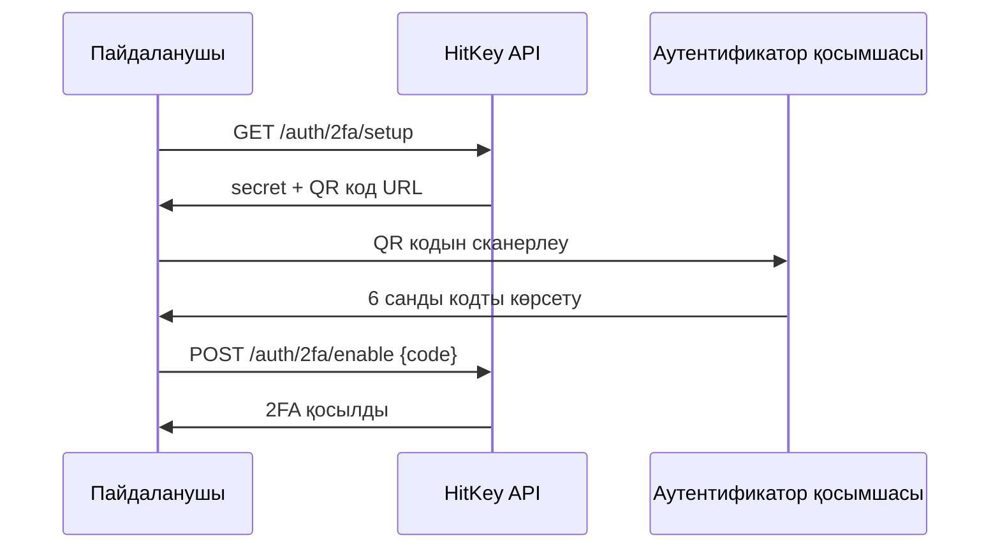

# Екі факторлы аутентификация

HitKey стандартты аутентификатор қосымшаларын (Google Authenticator, Authy, 1Password, т.б.) пайдаланатын TOTP негізіндегі екі факторлы аутентификацияны (2FA) қолдайды.

## Қалай жұмыс істейді

2FA қосылған кезде кіру екі қадамды талап етеді:
1. **Құпия сөз** — кәдімгі email + құпия сөз аутентификациясы
2. **TOTP коды** — аутентификатор қосымшасынан алынған 6 санды код

## Орнату ағыны



### 1. Орнату ақпаратын алу

```bash
curl https://api.hitkey.io/auth/2fa/setup \
  -H "Authorization: Bearer $TOKEN"
```

Жауап:

```json
{
  "secret": "JBSWY3DPEHPK3PXP",
  "qrCodeUrl": "otpauth://totp/HitKey:user@example.com?secret=JBSWY3DPEHPK3PXP&issuer=HitKey"
}
```

Пайдаланушы сканерлеуі үшін `qrCodeUrl`-ды QR код ретінде көрсетіңіз.

### 2. 2FA қосу

Пайдаланушы QR кодын сканерлеп, алғашқы TOTP кодын алғаннан кейін:

```bash
curl -X POST https://api.hitkey.io/auth/2fa/enable \
  -H "Authorization: Bearer $TOKEN" \
  -H "Content-Type: application/json" \
  -d '{"code": "123456"}'
```

## 2FA-мен кіру

2FA қосылғанда, `POST /auth/login` токен орнына `202` сынақ қайтарады:

```json
{
  "totp_required": true,
  "challenge_token": "a1b2c3d4e5f6..."
}
```

TOTP кодын тексеріп кіруді аяқтаңыз:

```bash
curl -X POST https://api.hitkey.io/auth/2fa/verify \
  -H "Content-Type: application/json" \
  -d '{
    "challenge_token": "a1b2c3d4e5f6...",
    "code": "654321"
  }'
```

Сәтті болғанда Bearer токені бар кәдімгі кіру жауабын қайтарады.

## 2FA-ны өшіру

```bash
curl -X POST https://api.hitkey.io/auth/2fa/disable \
  -H "Authorization: Bearer $TOKEN" \
  -H "Content-Type: application/json" \
  -d '{"code": "123456"}'
```

Әрекетті растау үшін жарамды TOTP коды қажет.

## OAuth ағынына әсері

2FA серіктес қосымшалар үшін **мөлдір**. 2FA қосылған пайдаланушы OAuth авторизация ағынынан өткенде:

1. HitKey фронтенді TOTP сынағын өңдейді
2. Авторизация коды тек 2FA сәтті аяқталғаннан кейін шығарылады
3. Сіздің қосымшаңызға ешқандай өзгерістер қажет емес

2FA қадамы толығымен HitKey кіру UI-інде жүреді — сіздің OAuth бағыттауыңыз пайдаланушының екі аутентификация қадамын аяқтауын күтеді.

## TOTP іске асыру мәліметтері

- **Алгоритм:** HMAC-SHA1 (RFC 6238)
- **Сандар:** 6
- **Кезең:** 30 секунд
- **Үйлесімді қосымшалар:** Google Authenticator, Authy, 1Password, Bitwarden, т.б.
