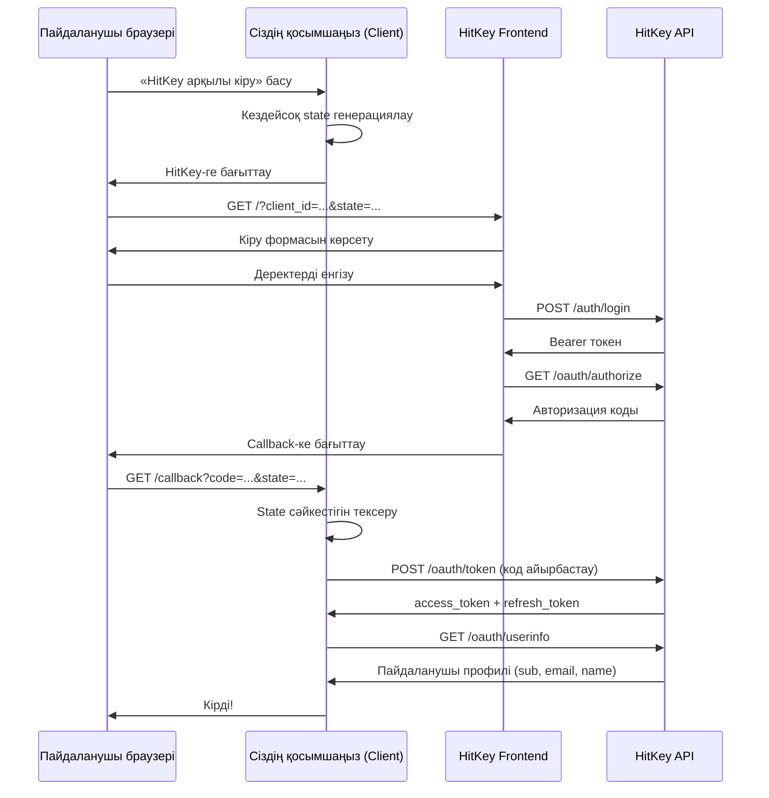

# OAuth2 Authorization Code Flow

HitKey OAuth2 Authorization Code Flow іске асырады — серверлік қосымшалар үшін ең қауіпсіз стандарт.

## Шолу



## Қадам бойынша

### 1. Авторизацияны бастау

Сіздің қосымшаңыз пайдаланушыны мына параметрлермен HitKey-ге бағыттайды:

```
https://hitkey.io/?client_id=CLIENT_ID&redirect_uri=REDIRECT_URI&response_type=code&state=STATE&scope=openid+profile+email
```

**Параметрлер:**

| Параметр | Міндетті | Сипаттама |
|----------|----------|-----------|
| `client_id` | Иә | Сіздің OAuth клиент ID |
| `redirect_uri` | Иә | Тіркелген callback URL |
| `response_type` | Иә | `code` болуы тиіс |
| `state` | Иә | CSRF қорғанысына арналған кездейсоқ жол |
| `scope` | Жоқ | Бос орынмен бөлінген scopes (әдепкі: `openid`) |

::: info State параметрі
Әрқашан криптографиялық кездейсоқ `state` мәнін генерациялаңыз, оны пайдаланушы сессиясында сақтаңыз және callback келгенде тексеріңіз. Бұл CSRF шабуылдарының алдын алады.
:::

### 2. Пайдаланушы аутентификациясы

HitKey фронтенді кіру UI-ін басқарады. Пайдаланушы:
- Бар деректермен **кіреді**
- Жаңа аккаунт **тіркейді** (3 қадамды электрондық пошта верификациясы)
- Қосылған болса **2FA аяқтайды**

Сіздің қосымшаңыз мұның ешқайсысын өңдемейді — HitKey бүкіл аутентификация UX-ін басқарады.

### 3. Авторизация коды

Сәтті аутентификациядан кейін HitKey API фронтендке JSON жауап қайтарады:

```json
{
  "redirect_url": "https://myapp.com/callback?code=AUTH_CODE&state=STATE"
}
```

Содан кейін фронтенд пайдаланушыны сіздің `redirect_uri`-ге мынамен бағыттайды:
- `code` — бір реттік авторизация коды (10 минут жарамды)
- `state` — 1-қадамда жіберген state-тің өзі

::: warning
Авторизация коды бір реттік. Токендерге айырбасталғаннан кейін қайта пайдалану мүмкін емес.
:::

### 4. Токен айырбастау

Сіздің **бэкенд** авторизация кодын токендерге айырбастайды:

```bash
POST https://api.hitkey.io/oauth/token
Content-Type: application/json

{
  "grant_type": "authorization_code",
  "code": "AUTH_CODE",
  "client_id": "YOUR_CLIENT_ID",
  "client_secret": "YOUR_CLIENT_SECRET",
  "redirect_uri": "https://myapp.com/callback"
}
```

Жауап:

```json
{
  "access_token": "eyJhbGciOi...",
  "refresh_token": "dGhpcyBpcyBh...",
  "token_type": "Bearer",
  "expires_in": 3600,
  "scope": "openid profile email"
}
```

::: danger
`client_secret`-ті ешқашан фронтенд кодында көрсетпеңіз. Токен айырбастау сіздің бэкендте болуы тиіс.
:::

### 5. Пайдаланушы ақпаратын алу

Пайдаланушы профилін алу үшін access токенді пайдаланыңыз:

```bash
GET https://api.hitkey.io/oauth/userinfo
Authorization: Bearer ACCESS_TOKEN
```

Жауап (берілген scopes-қа байланысты):

```json
{
  "sub": "550e8400-e29b-41d4-a716-446655440000",
  "id": "550e8400-e29b-41d4-a716-446655440000",
  "email": "user@example.com",
  "name": "John Doe",
  "given_name": "John",
  "family_name": "Doe",
  "display_name": "John Doe",
  "preferred_username": "johndoe"
}
```

### 6. Токенді жаңарту

Access токендер **1 сағаттан** кейін аяқталады. Жаңа access токен алу үшін refresh токенді пайдаланыңыз:

```bash
POST https://api.hitkey.io/oauth/token
Content-Type: application/json

{
  "grant_type": "refresh_token",
  "refresh_token": "REFRESH_TOKEN",
  "client_id": "YOUR_CLIENT_ID",
  "client_secret": "YOUR_CLIENT_SECRET"
}
```

::: info Токен ротациясы жоқ
OAuth жаңарту refresh токенді **ротацияламайды** — сол refresh токен жарамды болып қалады. Тек жаңа access токен шығарылады. Refresh токендердің 30 күндік жылжымалы терезесі мен 90 күндік абсолютті шегі бар.
:::

## Қауіпсіздік ескертулері

| Мәселе | Шешім |
|--------|-------|
| CSRF | `state` параметрі — генерациялаңыз, сессияда сақтаңыз, callback-те тексеріңіз |
| Кодты ұстау | Авторизация кодтары бір реттік және 10 минуттан кейін аяқталады |
| Токен ағуы | `client_secret` ешқашан бэкендтен шықпайды |
| Токен ұрлау | Қысқа мерзімді access токендер (1 сағат) |
| Қайталау шабуылдары | Пайдаланылған авторизация кодтары жарамсыз болады |

## Redirect URI сәйкестігі

HitKey салыстыру алдында redirect URI-ларды қалыпқа келтіреді:
- URL-кодтау автоматты түрде декодталады
- Соңғы слэштер өңделеді

Алайда, **домен, порт және жол** нақты сәйкес келуі тиіс. OAuth клиент жасаған кезде өндірістік URI-ді тіркеңіз.

## 2FA туралы не айтуға болады?

Егер пайдаланушыда 2FA қосылған болса, HitKey оны 2-қадамда мөлдір түрде өңдейді. Сіздің қосымшаңызға ешқандай өзгерістер қажет емес — кіру ағыны HitKey жағынан қосымша TOTP тексеру қадамын қамтиды.
