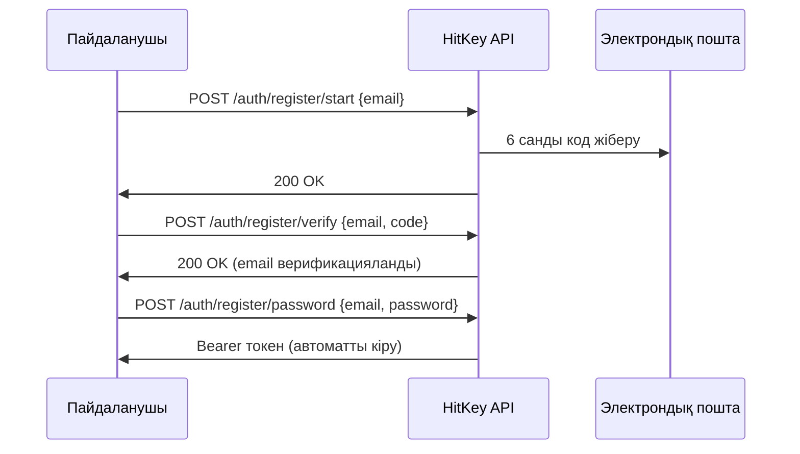

# Тіркелу

HitKey электрондық пошта верификациясымен 3 қадамды тіркелу ағынын пайдаланады.

## Ағынға шолу



## 1-қадам: Тіркелуді бастау

```bash
curl -X POST https://api.hitkey.io/auth/register/start \
  -H "Content-Type: application/json" \
  -d '{"email": "user@example.com"}'
```

Электрондық пошта мекенжайына 6 санды верификация коды жіберіледі.

**Код қасиеттері:**
- **10 минут** жарамды
- Максимум **3 верификация әрекеті**
- **60 секунд** кідірістен кейін қайта жіберуге болады

## 2-қадам: Email-ді верификациялау

```bash
curl -X POST https://api.hitkey.io/auth/register/verify \
  -H "Content-Type: application/json" \
  -d '{"email": "user@example.com", "code": "123456"}'
```

**Қателер:**

| Код | Сипаттама |
|-----|-----------|
| `INVALID_CODE` | Қате верификация коды |
| `CODE_EXPIRED` | Код мерзімі аяқталған (10 мин) |
| `TOO_MANY_ATTEMPTS` | 3 сәтсіз әрекет — жаңа код сұраңыз |
| `NO_CODE` | Бұл email үшін күтілетін верификация жоқ |
| `EMAIL_ALREADY_VERIFIED` | Email бұрыннан верификацияланған |

## 3-қадам: Құпия сөзді орнату

```bash
curl -X POST https://api.hitkey.io/auth/register/password \
  -H "Content-Type: application/json" \
  -d '{
    "email": "user@example.com",
    "password": "secure_password"
  }'
```

Сәтті болғанда пайдаланушы автоматты түрде кіреді және Bearer токен алады:

**Жауап `200`:**

```json
{
  "message": "Registration completed",
  "type": "bearer",
  "token": "hitkey_...",
  "refresh_token": "a1b2c3d4e5f6...",
  "expires_in": 3600,
  "user": {
    "id": "uuid",
    "email": "user@example.com",
    "displayName": "user"
  }
}
```

## Кодты қайта жіберу

```bash
curl -X POST https://api.hitkey.io/auth/register/resend \
  -H "Content-Type: application/json" \
  -d '{"email": "user@example.com"}'
```

::: info Кідіріс
Қайта жіберу эндпоинтінде теріс пайдалануды болдырмау үшін 60 секундтық кідіріс бар. Фронтенд кері санақ таймерін көрсетуі тиіс.
:::

## Шақыру арқылы тіркелу

Жобаға шақырылған пайдаланушылар бір қадамда тіркеле алады:

```bash
curl -X POST https://api.hitkey.io/auth/register/with-invite \
  -H "Content-Type: application/json" \
  -d '{
    "invite_token": "INVITE_TOKEN",
    "email": "user@example.com",
    "password": "secure_password"
  }'
```

Бұл email верификациясын өткізіп жібереді (шақыру дәлел ретінде қызмет етеді) және пайдаланушыны автоматты түрде жобаға қосады.

**Жауап `200`:**

```json
{
  "token": "hitkey_...",
  "refresh_token": "a1b2c3d4e5f6...",
  "expires_in": 3600,
  "user": {
    "id": "uuid",
    "email": "user@example.com",
    "displayName": "user"
  },
  "project_slug": "my-app",
  "redirect_url": "https://myapp.com/welcome"
}
```
