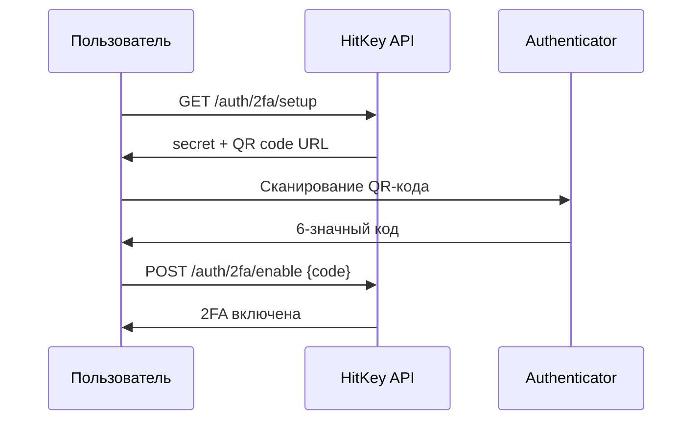

# Двухфакторная аутентификация

HitKey поддерживает TOTP-based двухфакторную аутентификацию (2FA) через стандартные authenticator-приложения (Google Authenticator, Authy, 1Password и др.).

## Как это работает

При включённой 2FA вход требует два шага:
1. **Пароль** — обычная аутентификация email + пароль
2. **TOTP-код** — 6-значный код из authenticator-приложения

## Настройка



### 1. Получение данных для настройки

```bash
curl https://api.hitkey.io/auth/2fa/setup \
  -H "Authorization: Bearer $TOKEN"
```

Ответ:

```json
{
  "secret": "JBSWY3DPEHPK3PXP",
  "qrCodeUrl": "otpauth://totp/HitKey:user@example.com?secret=JBSWY3DPEHPK3PXP&issuer=HitKey"
}
```

Отобразите `qrCodeUrl` как QR-код для сканирования.

### 2. Включение 2FA

```bash
curl -X POST https://api.hitkey.io/auth/2fa/enable \
  -H "Authorization: Bearer $TOKEN" \
  -H "Content-Type: application/json" \
  -d '{"code": "123456"}'
```

## Вход с 2FA

При включённой 2FA `POST /auth/login` возвращает ответ `202` с challenge:

```json
{
  "totp_required": true,
  "challenge_token": "a1b2c3d4e5f6..."
}
```

Завершите вход, подтвердив TOTP-код:

```bash
curl -X POST https://api.hitkey.io/auth/2fa/verify \
  -H "Content-Type: application/json" \
  -d '{
    "challenge_token": "a1b2c3d4e5f6...",
    "code": "654321"
  }'
```

## Отключение 2FA

```bash
curl -X POST https://api.hitkey.io/auth/2fa/disable \
  -H "Authorization: Bearer $TOKEN" \
  -H "Content-Type: application/json" \
  -d '{"code": "123456"}'
```

Требует действительный TOTP-код для подтверждения.

## Влияние на OAuth-flow

2FA **прозрачна** для партнёрских приложений. Фронтенд HitKey обрабатывает TOTP-challenge самостоятельно. Вашему приложению не нужны никакие изменения.

## Детали реализации TOTP

- **Алгоритм:** HMAC-SHA1 (RFC 6238)
- **Цифр:** 6
- **Период:** 30 секунд
- **Совместимые приложения:** Google Authenticator, Authy, 1Password, Bitwarden и др.
