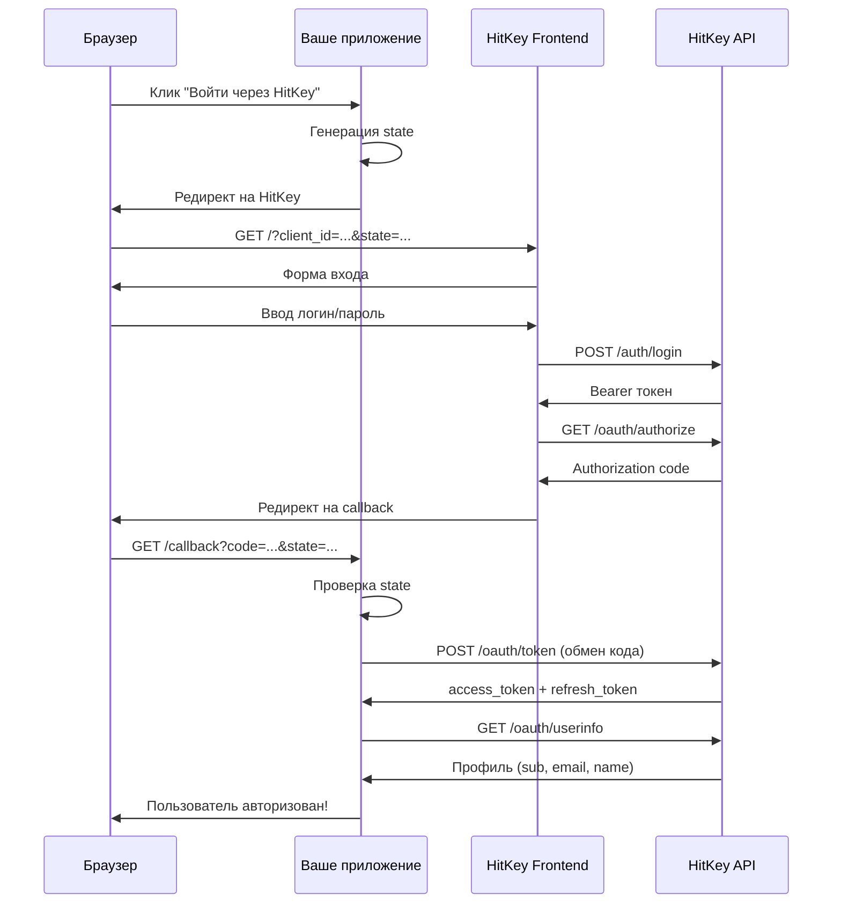

# OAuth2 Authorization Code Flow

HitKey реализует OAuth2 Authorization Code flow — самый безопасный стандарт для серверных приложений.

## Обзор



## Пошагово

### 1. Инициация авторизации

Ваше приложение перенаправляет пользователя на HitKey:

```
https://hitkey.io/?client_id=CLIENT_ID&redirect_uri=REDIRECT_URI&response_type=code&state=STATE&scope=openid+profile+email
```

**Параметры:**

| Параметр | Обязателен | Описание |
|----------|------------|----------|
| `client_id` | Да | ID вашего OAuth-клиента |
| `redirect_uri` | Да | Зарегистрированный callback URL |
| `response_type` | Да | Должен быть `code` |
| `state` | Да | Случайная строка для защиты от CSRF |
| `scope` | Нет | Scopes через пробел (по умолчанию: `openid`) |

::: info Параметр state
Всегда генерируйте криптографически случайное значение `state`, сохраняйте его в сессии и проверяйте при получении callback. Это защита от CSRF-атак.
:::

### 2. Аутентификация пользователя

Фронтенд HitKey обрабатывает весь UI входа. Пользователь может:
- **Войти** с существующими credentials
- **Зарегистрироваться** (3-шаговая верификация email)
- **Пройти 2FA** если включено

Ваше приложение ничего из этого не обрабатывает — HitKey управляет всем UX аутентификации.

### 3. Authorization Code

После успешной аутентификации API HitKey возвращает JSON:

```json
{
  "redirect_url": "https://myapp.com/callback?code=AUTH_CODE&state=STATE"
}
```

Фронтенд перенаправляет пользователя на ваш `redirect_uri` с:
- `code` — одноразовый authorization code (действителен 10 минут)
- `state` — тот же state, что вы отправили в шаге 1

::: warning
Authorization code одноразовый. После обмена на токены он не может быть использован повторно.
:::

### 4. Обмен токенов

Ваш **бэкенд** обменивает authorization code на токены:

```bash
POST https://api.hitkey.io/oauth/token
Content-Type: application/json

{
  "grant_type": "authorization_code",
  "code": "AUTH_CODE",
  "client_id": "YOUR_CLIENT_ID",
  "client_secret": "YOUR_CLIENT_SECRET",
  "redirect_uri": "https://myapp.com/callback"
}
```

::: danger
Никогда не раскрывайте `client_secret` во фронтенд-коде. Обмен токенов должен происходить на бэкенде.
:::

### 5. Получение информации о пользователе

```bash
GET https://api.hitkey.io/oauth/userinfo
Authorization: Bearer ACCESS_TOKEN
```

Ответ (зависит от scopes):

```json
{
  "sub": "550e8400-e29b-41d4-a716-446655440000",
  "id": "550e8400-e29b-41d4-a716-446655440000",
  "email": "user@example.com",
  "name": "John Doe",
  "given_name": "John",
  "family_name": "Doe",
  "display_name": "John Doe",
  "preferred_username": "johndoe"
}
```

### 6. Обновление токенов

Access-токены истекают через **1 час**. Используйте refresh-токен для получения нового access-токена:

```bash
POST https://api.hitkey.io/oauth/token

{
  "grant_type": "refresh_token",
  "refresh_token": "REFRESH_TOKEN",
  "client_id": "YOUR_CLIENT_ID",
  "client_secret": "YOUR_CLIENT_SECRET"
}
```

::: info Без ротации
OAuth-обновление **не ротирует** refresh-токен — тот же refresh-токен остаётся действительным. Обновляется только access-токен. Скользящее окно: 30 дней, абсолютный лимит: 90 дней.
:::

## Безопасность

| Угроза | Защита |
|--------|--------|
| CSRF | Параметр `state` — генерируйте, сохраняйте в сессии, проверяйте |
| Перехват кода | Одноразовые коды, истекают через 10 минут |
| Утечка токенов | `client_secret` не покидает бэкенд |
| Кража токенов | Короткоживущие access-токены (1ч) |
| Replay-атаки | Использованные коды аннулируются |

## Что насчёт 2FA?

2FA **прозрачна** для партнёрских приложений. Когда пользователь с включённой 2FA проходит OAuth-авторизацию, HitKey обрабатывает TOTP-challenge на своей стороне. Вашему приложению не нужны никакие изменения.
