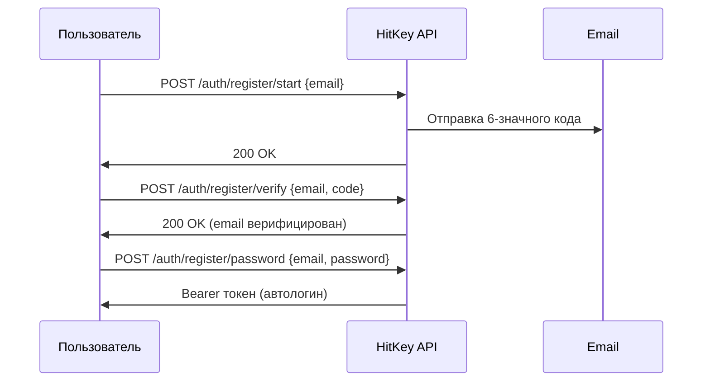

# Регистрация

HitKey использует 3-шаговый процесс регистрации с верификацией email.

## Обзор



## Шаг 1: Начало регистрации

```bash
curl -X POST https://api.hitkey.io/auth/register/start \
  -H "Content-Type: application/json" \
  -d '{"email": "user@example.com"}'
```

На email отправляется 6-значный код верификации.

**Свойства кода:**
- Действителен **10 минут**
- Максимум **3 попытки** верификации
- Повторная отправка через **60 секунд**

## Шаг 2: Верификация email

```bash
curl -X POST https://api.hitkey.io/auth/register/verify \
  -H "Content-Type: application/json" \
  -d '{"email": "user@example.com", "code": "123456"}'
```

**Ошибки:**

| Код | Описание |
|-----|----------|
| `INVALID_CODE` | Неверный код |
| `CODE_EXPIRED` | Код истёк (10 мин) |
| `TOO_MANY_ATTEMPTS` | 3 неудачных попытки — запросите новый код |
| `NO_CODE` | Нет ожидающей верификации для этого email |
| `EMAIL_ALREADY_VERIFIED` | Email уже верифицирован |

## Шаг 3: Установка пароля

```bash
curl -X POST https://api.hitkey.io/auth/register/password \
  -H "Content-Type: application/json" \
  -d '{
    "email": "user@example.com",
    "password": "secure_password"
  }'
```

При успехе пользователь автоматически входит и получает Bearer токен:

**Ответ `200`:**

```json
{
  "message": "Registration completed",
  "type": "bearer",
  "token": "hitkey_...",
  "refresh_token": "a1b2c3d4e5f6...",
  "expires_in": 3600,
  "user": {
    "id": "uuid",
    "email": "user@example.com",
    "displayName": "user"
  }
}
```

## Повторная отправка кода

```bash
curl -X POST https://api.hitkey.io/auth/register/resend \
  -H "Content-Type: application/json" \
  -d '{"email": "user@example.com"}'
```

::: info Кулдаун
Повторная отправка имеет кулдаун 60 секунд. На фронтенде рекомендуется показывать таймер обратного отсчёта.
:::

## Регистрация по приглашению

Пользователи, приглашённые в проект, могут зарегистрироваться в один шаг:

```bash
curl -X POST https://api.hitkey.io/auth/register/with-invite \
  -H "Content-Type: application/json" \
  -d '{
    "invite_token": "INVITE_TOKEN",
    "email": "user@example.com",
    "password": "secure_password"
  }'
```

Верификация email пропускается (приглашение служит подтверждением), и пользователь автоматически добавляется в проект.

**Ответ `200`:**

```json
{
  "token": "hitkey_...",
  "refresh_token": "a1b2c3d4e5f6...",
  "expires_in": 3600,
  "user": {
    "id": "uuid",
    "email": "user@example.com",
    "displayName": "user"
  },
  "project_slug": "my-app",
  "redirect_url": "https://myapp.com/welcome"
}
```
