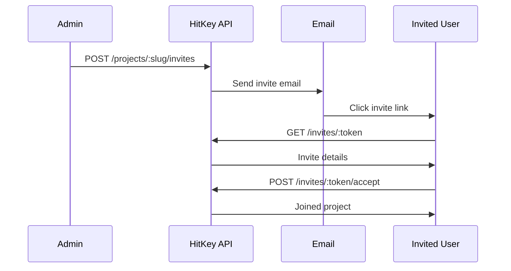

# Нуқтаҳои ниҳоии даъватномаҳо

Нуқтаҳои ниҳоии даъватнома даъватномаҳои лоиҳаро идора мекунанд. Баъзеашон оммавианд (дидани даъватнома), дигарон тасдиқи ҳувият талаб мекунанд (қабул кардан).

## Дидани даъватнома

Гирифтани маълумот дар бораи даъватнома тавассути token-и он. Ин нуқтаи ниҳоии оммавӣ аст — тасдиқи ҳувият лозим нест.

```
GET /invites/:token
```

**Ҷавоби `200`:**

```json
{
  "id": "invite-uuid",
  "email": "user@example.com",
  "role": "member",
  "project": {
    "name": "My App",
    "slug": "my-app"
  },
  "invitedBy": {
    "displayName": "Project Owner"
  },
  "expiresAt": "2024-01-15T00:00:00.000Z",
  "is_expired": false
}
```

**Хатогиҳо:**

| Ҳолат | Тавсиф |
|-------|--------|
| 404 | Даъватнома ёфт нашуд ё мӯҳлаташ гузашта |

---

## Қабули даъватнома

Қабули даъватномаи лоиҳа. Корбари тасдиқшуда бо нақши муайяншуда дар даъватнома ба лоиҳа пайваст мешавад.

```
POST /invites/:token/accept
```

**Тасдиқи ҳувият:** Ҳатмӣ

**Ҷавоби `200`:**

```json
{
  "project_slug": "my-app",
  "redirect_url": "https://myapp.com/welcome"
}
```

**Хатогиҳо:**

| Ҳолат | Рамз | Тавсиф |
|-------|------|--------|
| 400 | `INVITE_EXPIRED` | Мӯҳлати даъватнома гузаштааст |
| 400 | `EMAIL_MISMATCH` | Даъватнома ба email-и дигар фиристода шуда |
| 400 | `ALREADY_MEMBER` | Аллакай аъзои ин лоиҳа ҳастед |
| 404 | `INVITE_NOT_FOUND` | Даъватнома ёфт нашуд |

::: info Мувофиқати email
Агар даъватнома ба email-и муайян фиристода шуда бошад, корбари қабулкунанда бояд он email-ро дар ҳисоби HitKey-и худ тасдиқ карда бошад.
:::

---

## Ҷараёни даъватнома



## Бақайдгирӣ бо даъватнома

Корбарони нав метавонанд мустақиман тавассути истиноди даъватнома бақайд гиранд:

```
POST /auth/register/with-invite
```

**Бадани дархост:**

```json
{
  "invite_token": "INVITE_TOKEN",
  "email": "user@example.com",
  "password": "secure_password"
}
```

**Ҷавоби `200`:**

```json
{
  "token": "hitkey_...",
  "refresh_token": "a1b2c3d4e5f6...",
  "expires_in": 3600,
  "user": {
    "id": "uuid",
    "email": "user@example.com",
    "displayName": "User"
  },
  "project_slug": "my-app",
  "redirect_url": "https://myapp.com/welcome"
}
```

Ин ҳисоб месозад ва даъватномаро дар як қадам қабул мекунад, ва аз ҷараёни бақайдгирии муқаррарии 3-қадама мегузарад.
