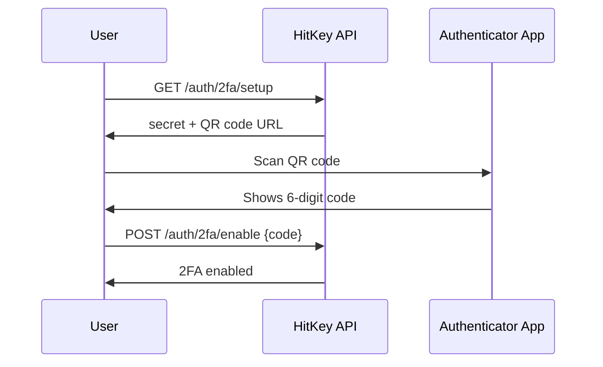

# Аутентификатсияи дуфакторӣ

HitKey аутентификатсияи дуфакторӣ (2FA)-ро бар асоси TOTP бо истифодаи барномаҳои стандартии authenticator (Google Authenticator, Authy, 1Password ва ғ.) дастгирӣ мекунад.

## Тарзи кор

Вақте ки 2FA фаъол аст, даромадан ду қадам талаб мекунад:
1. **Парол** — тасдиқи ҳувияти муқаррарӣ бо email + парол
2. **Рамзи TOTP** — рамзи 6-рақамаи аз барномаи authenticator

## Ҷараёни танзим



### 1. Гирифтани маълумоти танзим

```bash
curl https://api.hitkey.io/auth/2fa/setup \
  -H "Authorization: Bearer $TOKEN"
```

Ҷавоб:

```json
{
  "secret": "JBSWY3DPEHPK3PXP",
  "qrCodeUrl": "otpauth://totp/HitKey:user@example.com?secret=JBSWY3DPEHPK3PXP&issuer=HitKey"
}
```

`qrCodeUrl`-ро ҳамчун QR code барои скан кардан аз ҷониби корбар намоиш диҳед.

### 2. Фаъол кардани 2FA

Пас аз скан кардани QR code ва гирифтани аввалин рамзи TOTP аз ҷониби корбар:

```bash
curl -X POST https://api.hitkey.io/auth/2fa/enable \
  -H "Authorization: Bearer $TOKEN" \
  -H "Content-Type: application/json" \
  -d '{"code": "123456"}'
```

## Даромадан бо 2FA

Вақте ки 2FA фаъол аст, `POST /auth/login` ба ҷои token challenge-и `202` бармегардонад:

```json
{
  "totp_required": true,
  "challenge_token": "a1b2c3d4e5f6..."
}
```

Даромаданро бо тасдиқи рамзи TOTP анҷом диҳед:

```bash
curl -X POST https://api.hitkey.io/auth/2fa/verify \
  -H "Content-Type: application/json" \
  -d '{
    "challenge_token": "a1b2c3d4e5f6...",
    "code": "654321"
  }'
```

Дар ҳолати муваффақият, ҷавоби муқаррарии даромадан бо Bearer token бармегардад.

## Ғайрифаъол кардани 2FA

```bash
curl -X POST https://api.hitkey.io/auth/2fa/disable \
  -H "Authorization: Bearer $TOKEN" \
  -H "Content-Type: application/json" \
  -d '{"code": "123456"}'
```

Барои тасдиқи амал рамзи дурусти TOTP лозим аст.

## Таъсир ба ҷараёни OAuth

2FA барои барномаҳои шарикон **шаффоф** аст. Вақте ки корбар бо 2FA-и фаъол аз ҷараёни авторизатсияи OAuth мегузарад:

1. Frontend-и HitKey challenge-и TOTP-ро идора мекунад
2. Authorization code танҳо пас аз тасдиқи муваффақи 2FA содир мешавад
3. Барномаи шумо ба ягон тағйирот ниёз надорад

Қадами 2FA пурра дар дохили UI-и даромадани HitKey иҷро мешавад — redirect-и OAuth-и шумо танҳо интизори анҷоми ҳарду қадами тасдиқ аз ҷониби корбар мешавад.

## Тафсилоти татбиқи TOTP

- **Алгоритм:** HMAC-SHA1 (RFC 6238)
- **Рақамҳо:** 6
- **Давра:** 30 сония
- **Барномаҳои мувофиқ:** Google Authenticator, Authy, 1Password, Bitwarden ва ғ.
