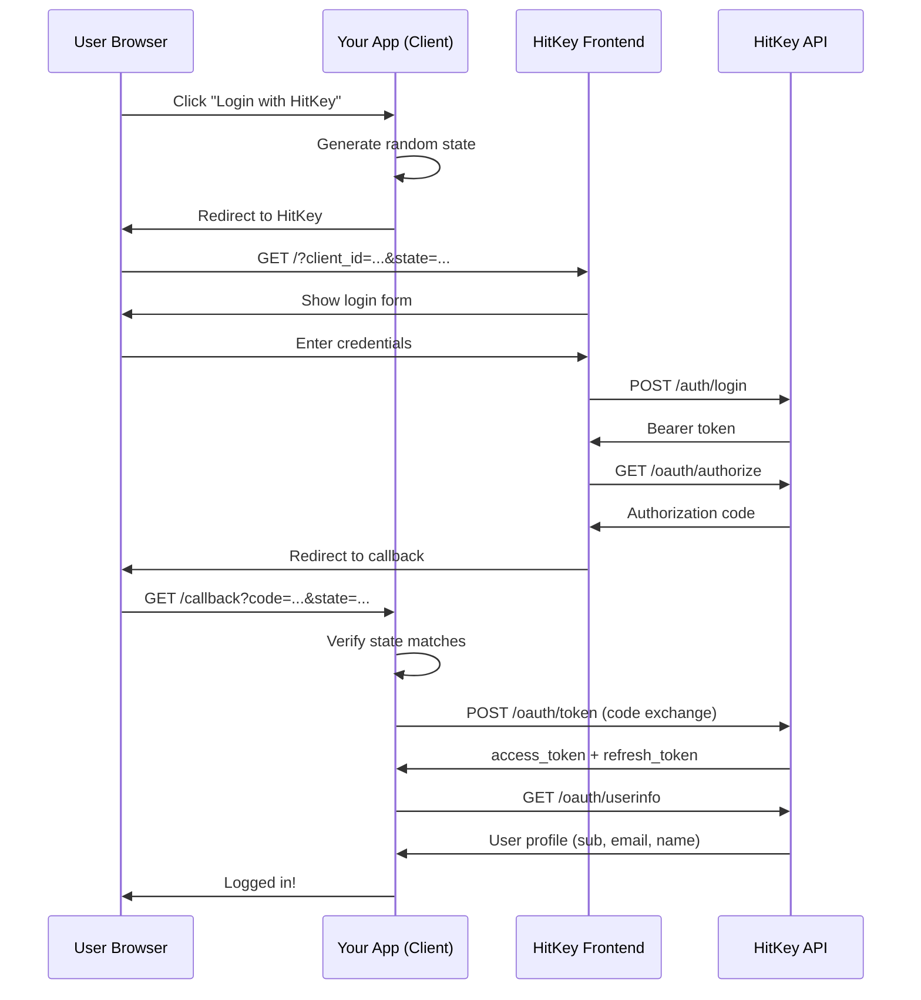

# OAuth2 Authorization Code Flow

HitKey ҷараёни OAuth2 Authorization Code-ро татбиқ мекунад — стандарти бехатартарин барои барномаҳои серверӣ.

## Шарҳи умумӣ



## Қадам ба қадам

### 1. Оғози авторизатсия

Барномаи шумо корбарро бо ин параметрҳо ба HitKey равона мекунад:

```
https://hitkey.io/?client_id=CLIENT_ID&redirect_uri=REDIRECT_URI&response_type=code&state=STATE&scope=openid+profile+email
```

**Параметрҳо:**

| Параметр | Ҳатмӣ | Тавсиф |
|----------|-------|--------|
| `client_id` | Ҳа | ID-и OAuth client-и шумо |
| `redirect_uri` | Ҳа | URL-и бақайдшудаи callback |
| `response_type` | Ҳа | Бояд `code` бошад |
| `state` | Ҳа | Сатри тасодуфӣ барои ҳифозат аз CSRF |
| `scope` | Не | Scope-ҳо бо фосила ҷудо шуда (пешфарз: `openid`) |

::: info Параметри state
Ҳамеша қимати криптографии тасодуфии `state`-ро эҷод кунед, дар сессияи корбар нигоҳ доред ва ҳангоми бозгашти callback тасдиқ кунед. Ин аз ҳуҷумҳои CSRF пешгирӣ мекунад.
:::

### 2. Тасдиқи ҳувияти корбар

Frontend-и HitKey UI-и даромаданро идора мекунад. Корбар ё:
- Бо маълумоти мавҷуда **ворид мешавад**
- Ҳисоби нав **бақайд мегирад** (тасдиқи email дар 3 қадам)
- **2FA-ро иҷро мекунад**, агар фаъол бошад

Барномаи шумо ҳеҷ яки инро идора намекунад — HitKey тамоми UX-и тасдиқи ҳувиятро идора мекунад.

### 3. Authorization Code

Пас аз тасдиқи муваффақ, API-и HitKey ба frontend ҷавоби JSON бармегардонад:

```json
{
  "redirect_url": "https://myapp.com/callback?code=AUTH_CODE&state=STATE"
}
```

Сипас frontend корбарро ба `redirect_uri`-и шумо бо ин маълумот равона мекунад:
- `code` — authorization code-и яквақта (10 дақиқа эътибор дорад)
- `state` — ҳамон state, ки дар қадами 1 фиристодед

::: warning
Authorization code яквақта аст. Пас аз иваз шудан ба token-ҳо, онро дубора истифода бурдан мумкин нест.
:::

### 4. Мубодилаи Token

**Backend**-и шумо authorization code-ро ба token-ҳо иваз мекунад:

```bash
POST https://api.hitkey.io/oauth/token
Content-Type: application/json

{
  "grant_type": "authorization_code",
  "code": "AUTH_CODE",
  "client_id": "YOUR_CLIENT_ID",
  "client_secret": "YOUR_CLIENT_SECRET",
  "redirect_uri": "https://myapp.com/callback"
}
```

Ҷавоб:

```json
{
  "access_token": "eyJhbGciOi...",
  "refresh_token": "dGhpcyBpcyBh...",
  "token_type": "Bearer",
  "expires_in": 3600,
  "scope": "openid profile email"
}
```

::: danger
Ҳеҷ гоҳ `client_secret`-ро дар коди frontend ошкор накунед. Мубодилаи token бояд дар backend-и шумо иҷро шавад.
:::

### 5. Гирифтани маълумоти корбар

Access token-ро барои гирифтани профили корбар истифода баред:

```bash
GET https://api.hitkey.io/oauth/userinfo
Authorization: Bearer ACCESS_TOKEN
```

Ҷавоб (ба scope-ҳои додашуда вобаста аст):

```json
{
  "sub": "550e8400-e29b-41d4-a716-446655440000",
  "id": "550e8400-e29b-41d4-a716-446655440000",
  "email": "user@example.com",
  "name": "John Doe",
  "given_name": "John",
  "family_name": "Doe",
  "display_name": "John Doe",
  "preferred_username": "johndoe"
}
```

### 6. Навсозии Token

Access token-ҳо пас аз **1 соат** беэътибор мешаванд. Refresh token-ро барои гирифтани access token-и нав истифода баред:

```bash
POST https://api.hitkey.io/oauth/token
Content-Type: application/json

{
  "grant_type": "refresh_token",
  "refresh_token": "REFRESH_TOKEN",
  "client_id": "YOUR_CLIENT_ID",
  "client_secret": "YOUR_CLIENT_SECRET"
}
```

::: info Бе ротатсияи token
Навсозии OAuth refresh token-ро **ротатсия намекунад** — ҳамон refresh token эътибор мемонад. Танҳо access token-и нав содир мешавад. Refresh token-ҳо равзанаи 30-рӯзаи лағжанда ва ҳадди мутлақи 90-рӯза доранд.
:::

## Мулоҳизаҳои амниятӣ

| Нигаронӣ | Роҳи ҳалли |
|----------|-----------|
| CSRF | Параметри `state` — эҷод кунед, дар сессия нигоҳ доред, ҳангоми callback тасдиқ кунед |
| Забти code | Authorization code-ҳо яквақтаанд ва дар 10 дақиқа беэътибор мешаванд |
| Фош шудани token | `client_secret` ҳеҷ гоҳ аз backend-и шумо берун намеравад |
| Дуздии token | Access token-ҳои кӯтоҳмуддат (1с) |
| Ҳуҷумҳои replay | Authorization code-ҳои истифодашуда беэътибор мешаванд |

## Мувофиқати Redirect URI

HitKey redirect URI-ҳоро пеш аз муқоиса нормализатсия мекунад:
- URL-encoding худкор декод мешавад
- Trailing slash-ҳо идора мешаванд

Аммо **домен, порт ва масир** бояд дақиқ мувофиқ бошанд. URI-и production-ро ҳангоми сохтани OAuth client бақайд гиред.

## 2FA чӣ?

Агар корбар 2FA-ро фаъол карда бошад, HitKey онро дар қадами 2 шаффоф идора мекунад. Барномаи шумо ба ягон тағйирот ниёз надорад — ҷараёни даромадан танҳо як қадами иловагии тасдиқи TOTP-ро дар тарафи HitKey дар бар мегирад.
