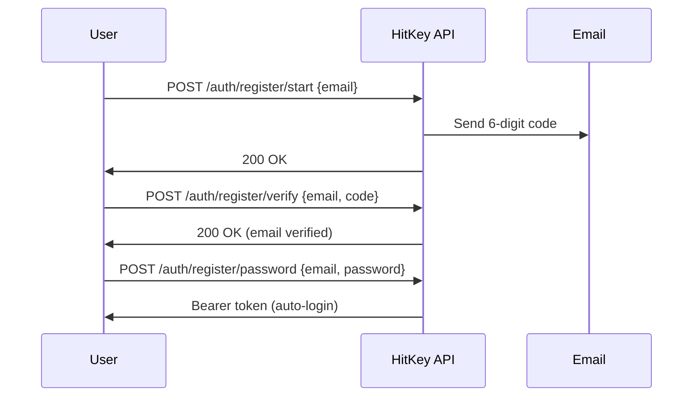

# Бақайдгирӣ

HitKey ҷараёни бақайдгирии 3-қадама бо тасдиқи email истифода мебарад.

## Шарҳи ҷараён



## Қадами 1: Оғози бақайдгирӣ

```bash
curl -X POST https://api.hitkey.io/auth/register/start \
  -H "Content-Type: application/json" \
  -d '{"email": "user@example.com"}'
```

Рамзи тасдиқии 6-рақама ба суроғаи email фиристода мешавад.

**Хусусиятҳои рамз:**
- **10 дақиқа** эътибор дорад
- Ҳадди аксар **3 кӯшиши** тасдиқ
- Пас аз **60 сония** интизорӣ аз нав фиристодан мумкин аст

## Қадами 2: Тасдиқи Email

```bash
curl -X POST https://api.hitkey.io/auth/register/verify \
  -H "Content-Type: application/json" \
  -d '{"email": "user@example.com", "code": "123456"}'
```

**Хатогиҳо:**

| Рамз | Тавсиф |
|------|--------|
| `INVALID_CODE` | Рамзи тасдиқ нодуруст аст |
| `CODE_EXPIRED` | Мӯҳлати рамз гузаштааст (10 дақ.) |
| `TOO_MANY_ATTEMPTS` | 3 кӯшиш ноком — рамзи нав дархост кунед |
| `NO_CODE` | Тасдиқи интизорӣ барои ин email нест |
| `EMAIL_ALREADY_VERIFIED` | Email аллакай тасдиқ шудааст |

## Қадами 3: Гузоштани парол

```bash
curl -X POST https://api.hitkey.io/auth/register/password \
  -H "Content-Type: application/json" \
  -d '{
    "email": "user@example.com",
    "password": "secure_password"
  }'
```

Дар ҳолати муваффақият, корбар худкор ворид мешавад ва Bearer token мегирад:

**Ҷавоби `200`:**

```json
{
  "message": "Registration completed",
  "type": "bearer",
  "token": "hitkey_...",
  "refresh_token": "a1b2c3d4e5f6...",
  "expires_in": 3600,
  "user": {
    "id": "uuid",
    "email": "user@example.com",
    "displayName": "user"
  }
}
```

## Аз нав фиристодани рамз

```bash
curl -X POST https://api.hitkey.io/auth/register/resend \
  -H "Content-Type: application/json" \
  -d '{"email": "user@example.com"}'
```

::: info Давраи интизорӣ
Нуқтаи аз нав фиристодан давраи интизории 60-сонияро барои пешгирӣ аз суиистифода дорад. Frontend бояд ҳисобкунаки баръакс нишон диҳад.
:::

## Бақайдгирӣ бо даъватнома

Корбароне, ки ба лоиҳа даъват шудаанд, метавонанд дар як қадам бақайд гиранд:

```bash
curl -X POST https://api.hitkey.io/auth/register/with-invite \
  -H "Content-Type: application/json" \
  -d '{
    "invite_token": "INVITE_TOKEN",
    "email": "user@example.com",
    "password": "secure_password"
  }'
```

Ин тасдиқи email-ро нагузаронад (даъватнома ҳамчун исбот хизмат мекунад) ва корбарро худкор ба лоиҳа илова мекунад.

**Ҷавоби `200`:**

```json
{
  "token": "hitkey_...",
  "refresh_token": "a1b2c3d4e5f6...",
  "expires_in": 3600,
  "user": {
    "id": "uuid",
    "email": "user@example.com",
    "displayName": "user"
  },
  "project_slug": "my-app",
  "redirect_url": "https://myapp.com/welcome"
}
```
